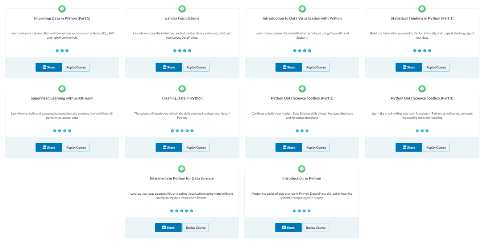
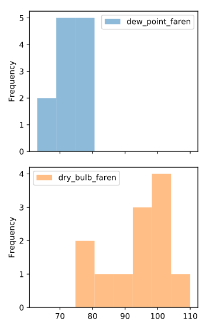
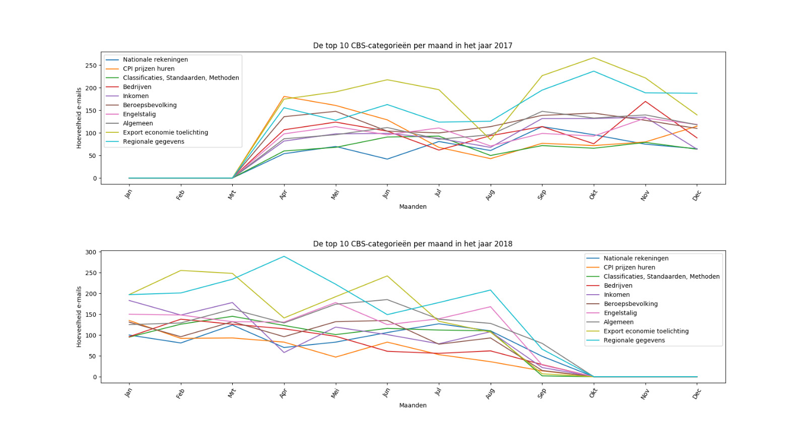

# Datacamp Courses
Datacamp takes a very practical approach to learning. Every course and chapter starts with a video explaining a 
concept, the assignments after that implement the explained topic with prepared data. This allowed me to 
experiment quite fast. The completed courses were mostly assigned however some of the assignments included just 
one or two chapters, I decided to complete all the partial courses.

Some of these courses contributed to the project. Others weren't relevant to the project but did 
expand our knowledge on data science as a whole. Below is a screenshot of the completed courses.



**Note: The courses discussed below, are not in order of completion.**

## Importing Data in Python (Part 1)
[link to course on Data Camp](https://www.datacamp.com/courses/importing-data-in-python-part-1)

### Description Course
This course is based on as the name suggests, importing data. During the course you get excercises for importing 
flat files, pickled files, spreadsheets and relational databases

### Improvements by this course
This course helped us discover an easy way to import the delivered data for the project as well as 
the parameters needed.

For example in our Importer, we used one of the most simple import functions from pandas. 
We also used a package 'pathlib' so we didn't have to pass the whole file adress.

```python
import pandas as pd
from pathlib import Path 

def read_csv_into_dataframe(classified_file):
    return pd.read_csv('{0}/result/{1}'.format(Path().absolute(), classified_file), error_bad_lines=False, skip_blank_lines=True).dropna()
```

## Introduction to Python
[link to course on Data Camp](https://www.datacamp.com/courses/intro-to-python-for-data-science)

This course teaches some Python basics as well as some data science specific Python code. 
The basic data types, introduction to functions and packages. Lastly some exercises about NumPy.

### Improvements by this course
The first three chapters of this course were a refresher since I already had some Python experience. 
The last chapter however I was not familiar with NumPy and it's functions which turned out to be very useful later 
on. The specific knowledge from this part of numpy has been a foundation for the Pandas courses.


## Pandas Foundations
[link to course on Data Camp](https://www.datacamp.com/courses/pandas-foundations)

The Pandas foundations course taught the Pandas basics. Importing a dataframe, displaying a dataframe or part of it. 
Selecting a specific part of it and displaying information about the dataframe. It also contains some more 
advanced concepts as upsampling, downsampling and interpolation. Visualization is also included in this chapter. 

### Improvements by this course
With the knowledge we acquired by this course we were able to generate dataframes to classify our sentences, 
learned how to make a dataframe from lists and export our dataframes to actually be able to classify them. 

For example, the exporting of a dataframe. As showed, could be done by a simple pandas dataframe function.
```python
# Save the cleaned up DataFrame to a CSV file without the index
dataframe.to_csv(file_name, index=False)
```

As for the visualizations, an example for this is in the 3rd chapter. It includes the making of a histogram. 

Input
```python
# Resample dew_point_faren and dry_bulb_faren by Month, aggregating the maximum values: monthly_max
monthly_max = df_clean[['dew_point_faren','dry_bulb_faren']].resample('M').max()

# Generate a histogram with bins=8, alpha=0.5, subplots=True
monthly_max.plot(kind='hist',bins=8,alpha=0.5,subplots=True)

# Show the plot
plt.show()
```

Output



## Introduction to Data Visualization with Python
[link to course on Data Camp](https://www.datacamp.com/courses/introduction-to-data-visualization-with-python)

As the title of the course portrays, this course teaches data visualization in Python. 
This includes customizing plots, e.g. adding titles, labels, legends and customizing colors for basic plots. 
For some more advanced plotting, how to visualize 2d arrays and a little Seaborn.

### Improvements by this course
The easiest part of this course, customizing plots, has served the biggest purpose in the visualizations for 
the project. As I have made a few plots with this specific course next to it. An example for this is: 




## Statistical Thinking in Python (Part 1)
[link to course on Data Camp](https://www.datacamp.com/courses/statistical-thinking-in-python-part-1)
This is one of the more theoretical courses I have made. It includes graphical and quantitative exploratory 
data analysis, which comes down to finding properties of the data. Graphical searches these properties by 
visualizations and quantitative by summaries, averages, means etc. The second part of the course includes 
exercises to think probabilistically divided in discrete variables and continuous variables. 

### Improvements by this course
This course has not specifically contributes to certain tasks. 
However I did find this more theoretical approach very interesting. 

## Supervised Learning with scikit-learn
[link to course on Data Camp](https://www.datacamp.com/courses/supervised-learning-with-scikit-learn)
This course contains very useful exercises for using scikit-learn. Specifically classification and regression problems,
fine-tuning models and pre-processing and pipelines. It shows some available functions, 
how to create models and which parameters to use.

### Improvements by this course
This course has been a great foundation for our predictive modelling. Since scikit-learn includes a lot of easily 
accessible functions to create models, create features and tuning models, we decided to base most of our project
on the scikit package. This course has been the stepping stone to that choice. 

For example the use of count-vectors from our project: 

```python
count_vect = CountVectorizer(analyzer='word', token_pattern=r'\w{1,}', max_df=1.0, max_features=features)
        count_vect.fit(self.trainDF['cleaned_sentence'])
        xtrain_count = count_vect.transform(self.X_train)
```

Sklearn includes a 'CountVectorizer' class which is implemented in just 3 lines of code. This allows for fast and
easy experimenting with the features. 

## Cleaning Data in Python
[link to course on Data Camp](https://www.datacamp.com/courses/cleaning-data-in-python)

### Improvements by this course


## Python Data Science Toolbox (Part 1)
[link to course on Data Camp](https://www.datacamp.com/courses/python-data-science-toolbox-part-1)

### Improvements by this course


## Python Data Science Toolbox (Part 2)
[link to course on Data Camp](https://www.datacamp.com/courses/python-data-science-toolbox-part-2)

### Improvements by this course


## Intermediate Python for Data Science
[link to course on Data Camp](https://www.datacamp.com/courses/intermediate-python-for-data-science)

### Improvements by this course
