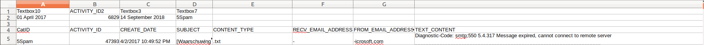
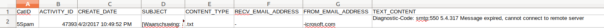

# Data Preparation
For this document, the preparation of data includes the cleaning of data and the preparing of features. 
Data preparation is the process of turning your data into the most optimal information for your predictive model.
For out project and data set this meant filtering the useless data, cleaning the email itself as much as 
possible and normalizing the data. Implementing the preparing of features was a rather easy task because of 
the package we used, sklearn. 

## Data Cleaning 
Starting with data cleaning. This process became an obvious task after analyzing the first dataset. 
It included double emails, internal emails, emptied tags etc. We started this process by actually getting the 
email body from the text content. 

## Retrieving the email
### Example email
For this portfolio email I display an English example, however the goal in the project was to retrieve the Dutch 
topics. The English emails have been filtered. 

```text
formID: 1030
         Name: Pat
Email_address: -
EmailContactpersoon: -
   Telefoonnr: -
   submitTime: 4/06/2017 10:25:45 PM
Subject: Labour and social security 
Question:
Hi - is it possible to obtain the unemployment rate for the last 10 years in the entire country and the city of Amsterdam?  Many thanks, Pat
```

### Process
We attempted to find rules in the syntax that the data was in. After some analysis we found out the best general 
rule we could set up was: the actual email content starts with 'Question: \n' in the English examples and 'Vraag: \n'
in the Dutch examples. This is also how we managed to filter the English emails. This rule did not apply at all times, 
but did so sufficiently. 

The code associated with this process is displayed below:
```python
split = str(raw_text_context).split('Vraag:', 1)

if len(split) == 1:
    split = raw_text_context.split('Question:', 1)
    if len(split) > 1:
        return

if len(split) > 1:
    split.pop(0)

return split[0]
```

We applied this function to every email and appended this to a list or dataframe. 


### Cleaning of the files itself 
Before signing the NDA we asked to receive the following dataset in a different format, preferrably a CSV. We did 
receive the rest of the data in this format but it contained some extra data from the export in every file. To 
split this we simply read every CSV as a text file and splitted on 'CATID', then exported the value of index 1 in the 
list of the result as a new CSV. 

Before the cleaning


After the cleaning


### Cleaning of the sentences
example of the cleaning of a sentence
For cleaning sentences we applied several methods. These include the normalisation of locations, numbers and urls. 
The removal if diacritics, spaces, punctuation and stopwords. For this example I will enlighten the way we 
normalized locations. 

To be able to normalize locations we had to be able to recognise these. We collected a table of all the villages 
and towns and made a function that checked for every word in a sentence if it was equal to any of the locations in 
the list. To check this we used a regex.

```python
import re
def normalize_location_data(self):
    regex = re.compile(r'\b%s\b' % r'\b|\b'.join(map(re.escape, self.locations)))
    self.sentence = regex.sub('LOCATIE', self.sentence)
```
Because we had to check 2 lists with each other, we optimized the speed of this process by creating a regex that 
included all of the locations. In this example self.locations was the list of locations and self.sentence is the 
sentence.

## Feature Preparation
Feature preparation in our project was quite a simple process as mentioned earlier. We used Sklearn for this process 
which included functions for the types of features we used. We found out how to use these feature preparators by 
referencing the Sklearn documentation.

```python
from sklearn.feature_extraction.text import CountVectorizer

def count_vectors(all_text, X, amount_features=None):
    count_vect = CountVectorizer(
        analyzer='word', token_pattern=r'\w{1,}', max_df=1.0, max_features=amount_features)

    count_vect.fit(all_text)
    X_count = count_vect.transform(X)

    return X_count
```

For all of these instances we created a class, the FeaturePreparator with the necessary parameters. The class contains 
functions for count_vectors, TFIDF on word level, TFIDF on n-gram level, TFIDF on character level.

## Non project feature preparation ( non text classification feature preparation)

