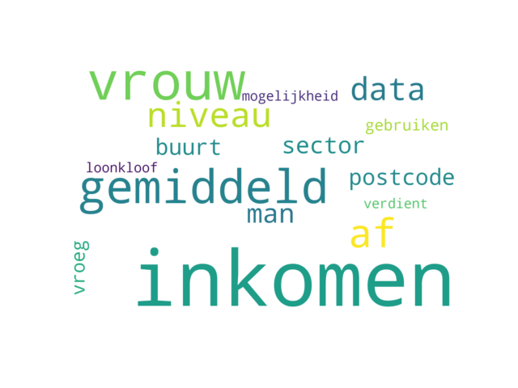
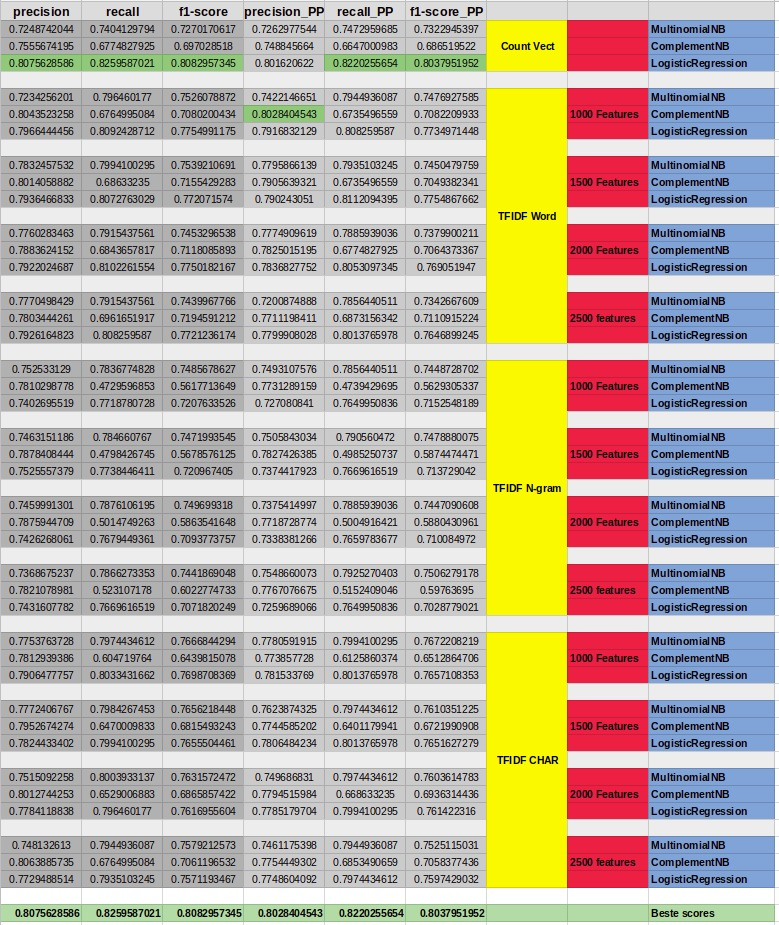

# Visualization 
Data visualization is the way to communicate results most efficiently. the goal is to provide insight at the first 
look. I have performed visualization with plotting as well as manually.  

## Project Related
In the project we diagnosed most actions and progress based on visualizations. Beneath I will elaborate a few of the 
visualizations that are project related.

### Confusion matrix
A confusion matrix is a matrix that displays the true positives, false positives, true negatives and false negatives 
in a diagram. We have created these in a normalized way as well as a non-normalized way.

#### In code 
To get the matrix data, Sklearn has a function called confusion_matrix. The parameters passed to this function are the 
predictions and valid answers.

```python
from sklearn.metrics import confusion_matrix
import itertools
import numpy as np
import matplotlib.pyplot as plt
    
# Retrieving the matrix data, passing the valid classifications and prediction classifications.
cm = confusion_matrix(valid_classifications, prediction_classifications)

# The 4 classes that the scores(1,2,3,4) represent.
classes = ['Beschikbaarheidsvraag', 'Verduidelijkingsvraag', 'Niet relevant', 'Relevante query vraag']

plt.imshow(cm, interpolation='nearest', cmap=plt.cm.Blues)
plt.title('Confusion matrix')
plt.colorbar()
tick_marks = np.arange(len(classes))
plt.xticks(tick_marks, classes, rotation=45)
plt.yticks(tick_marks, classes)

threshold = cm.max() / 2.

for i, j in itertools.product(range(cm.shape[0]), range(cm.shape[1])):
    plt.text(j, i, format(cm[i, j], 'd'), horizontalalignment="center", color="white" if cm[i, j] > threshold else "black")

plt.ylabel('True label')
plt.xlabel('Predicted label')
plt.tight_layout()
```

#### Result
The result of this code is the image below. It allowed us to see the scores for every category in a clear way. 


### Counts per month
The visualization example below was one of the firsts global insights we created in the extended dataset. 
After receiving this we wanted to visualize some statistics on the complete set. 
By extracting the amount of emails per month per category, we were able to create the graph below. 

#### In code
The code associated with this graph will be pasted and explained below. 

```python
import matplotlib as plt

def visualize_categories(self, file_name, month_counts, legends):
    # Since the file names contain some extra non-descriptive characters, they are removed for the plot.
    correct_file_name = file_name.split('/').pop().split('.')[0][1:]
    plt.title(correct_file_name)
    # Add the ticks to the plot
    plt.xticks(list(month_counts.keys()), ('Jan', 'Feb', 'Mrt', 'Apr', 'Mei', 'Jun', 'Jul', 'Aug', 'Sep', 'Okt', 'Nov', 'Dec'), rotation=60)
    plt.xlabel('Maanden')
    plt.ylabel('Hoeveelheid e-mails')
    #plt.plot returns more values, by using line, it only saves the first returned argument and disposes the rest. 
    line,  = plt.plot(month_counts.keys(), month_counts.values(), label=correct_file_name)
    legends.append(line)

def get_and_plot_all_categories(self):
    plt.clf()
    plt.cla()
    # In the called function below the top 10 categories are concatinated to 1 dataframe, since every row includes a 
    # date and the CATID, we were able to count the emails per month per category. The function creates a dictionary 
    # with counts per month, per category. 
    files_with_counts_per_month = self.get_csv_counts_all()
    legends = list()

    # For every category in the dictionary, the visualize method is called. This visualize method appends a new line
    # to the plot. 
    for k, v in files_with_counts_per_month.items():
        self.visualize_categories(k, v, legends)

    plt.title('De top 10 CBS-categorieën per maand')
    plt.legend(handles=legends)
    plt.show()
```
#### Result
The result of the above explained code is this graph.


### Word web
A word web is a way of visualizing the topics we retrieved from NMF and/or LDA. These wordwebs are as the name 
suggests, webs of words. To actually make these wordwebs, I found a package wordclouder. This actually rendered a 
wordweb based on a corpus. Since the topics retrieved from LDA were words, I had to make a function that got the 
counts of the topic words and created a corpus by appending the words as many times as they occur in the dataset.

#### In code 
```python
from wordcloud import WordCloud
import matplotlib.pyplot as plt

def create_wordcloud(self, max_words, wordcloud_corpus):
    # The parameters for the wordcloud generation are pretty straight forward.
    # Collocations, is a setting to include word pairs. This setting wasn't used. 
    
    wordcloud = WordCloud(
                            background_color='white', 
                            width=1600, 
                            height=1000, 
                            collocations=False, 
                            max_words=max_words,
                            stopwords=self.stopwords).generate(wordcloud_corpus)
    # Since the wordcloud is generated as an image, I used imshow to display it. 
    plt.imshow(wordcloud, interpolation='bilinear')
    plt.axis("off")
    plt.show()
    plt.clf()
    plt.cla()
```

#### Result


## Manual Visualization
At a certain point, I made exports of scores with a lot of different hyperparameters and or models. 
I then used these exports to create graphs in google spreadsheet, instead of with Python.
### Scores
This example was the visualization of scores for different ratios of skewed data. To generate this graph, 
I used the exports instead of the data in python.
#### In code 
Since the code was not relevant for the visualization, it isn't included in this piece. But to explain briefly, 
the code created models for a range of values and these models were each tested and exported the scores. 

The result of the code as data is displayed below. 


#### Result
The resulting graph with the data from the export displayed above.

