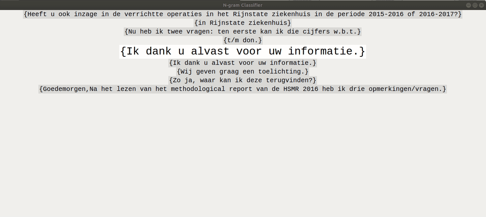

### Classification Tooling

The process of labeling our sentences took quite some time and was not a smooth process. To Be able to do this I made 
a tool for us to label our sentences faster. The tool imports all the sentences, displays 9 of them on screen, 
the to-classify sentence and the 4 before and the 4 after. It waits for an input classification (1, 2, 3 or 4) and 
after input appends this sentence to the classified sentences file. Then it displays the next sentence. Also it begins 
where you left off. 

