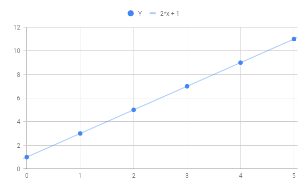
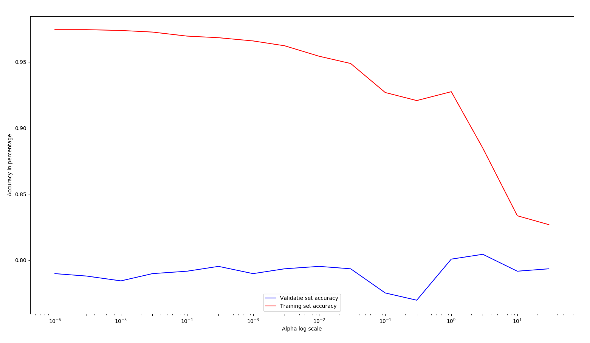

# Predictive Modelling
Predictive modelling is the actual code that is the implementation of machine learning or AI. These are ways to 
find correlations between found parameters or features in your data set. 

### Cost functions
A big part in predictive modelling is the understanding of the cost function. There are several types of cost 
functions for types of scoring. The cost functions generally is a function that calculates the error for a 
specific model. It does so by getting the cumulative error on the training examples of a model. The function that 
fits the model iterates over the data to find the function(model) with the smallest output of the cost function.

For our project, we didn't have to write these ourselves, they were included in the functions from scikit-learn. 

## Regression
Regression is a concept where you try to regress data to a function. You try to fit the data to a line with the 
smallest error.

### Linear
Linear regression is the  form of regression where you regress data to a linear line. The function for such 
a line has a format of y= ax + b. 

#### Example
Var1(x) | Output (y)
---|---
0 | 1
1 | 2
2 | 5
3 | 7
4 | 9

Fitting a line to this data can be achieved in several ways. But to serve the purpose of this easy example, I will 
just state state that the function that fits this data perfectly is y = 2x+1. 

This function would look like this in a plot


### Polynomial
Now, a polynomial is a function that is more complex than a linear function. It includes exponentials and higher 
polynomial features. This means it can fit more complex data as well. Finding this function however is more complicated. 
A simple calculation often won't ddo the trick. So there are functions to find the optimal values for fitting data. 

One of these methods is gradient descent. You try to approximate the 0 point for the derivative of the cost function. 

### Regularization
Regularization is a factor in machine learning that penalizes extreme values. This parameter can be passed to 
create a more generalized model. It adds a weight to the value of features. In case these features get extreme values, 
the cost they add to the cost function will be big aswell. Since the goal is to minimize that, the optimal function 
found, will contain less extreme values.

## Classification
Classification broadly explained is the creating of a machine learning model that can put out a discrete value. An 
example of this is a binary classifier that either outputs 1 or zero.

### Practical Example
Referring to the manual data collection example for weather data. The difference is the value you are 
trying to predict. When trying to predict the temperature, this could be any continuous value. This would not be 
the case for wind direction. There are 8 different values for this. If you would train a model to classify the 
outcome of wind direction, it would have to be one of the possible values, hence classification. 

Date | Temperature | Wind Speed | Wind Direction | Humidity |
-----| ------------| -----------| ---------------| ---------|
01-12-2018 | 28 | 15 | NW | 5 |
02-12-2018 | 26 | 13 | NW | 12 |
03-12-2018 | 25 | 18 | SW | 8 |
04-12-2018 | 24 | 19 | SW | 4 |
05-12-2018 | 23 | 3 | NW | 7 |

### Code example
The next code example will be a multinomial Naive Bayes model, based on count vectors. It is a simplified version 
of the code implemented in our project. In the project, the actual function is made to check several models 
based on count vectors, and export their scores to a CSV file. 

```python
from sklearn import multiclass
from sklearn.feature_extraction.text import CountVectorizer
from sklearn import linear_model, naive_bayes
from sklearn.metrics import precision_recall_fscore_support as score
 
def count_vectors(self, features):
    count_vect = CountVectorizer(analyzer='word', token_pattern=r'\w{1,}', max_df=1.0, max_features=features)
    count_vect.fit(self.trainDF['cleaned_sentence'])
    
    xtrain_count = count_vect.transform(self.X_train)
    xcross_count = count_vect.transform(self.X_cross)

    model = naive_bayes.MultinomialNB(alpha=0.767, class_prior=None, fit_prior=True)
    mc_model = multiclass.OneVsRestClassifier(model)
    classifier = mc_model.fit(xtrain_count, self.y_train)

    # Cross Validation predictions
    self.check_model(classifier, xcross_count, self.y_cross)
       
def check_model(self, classifier, X, y):
    predictions = self.funcs.return_prediction_data(classifier,
                                                    X)
    classifications = y.reset_index(drop=True)
    precision, recall, f_score, true_sum = score(classifications,
                                                 predictions,
                                                 average='weighted')
```

The function 'count_vectors' serves to 
* Create the Count vectorizer
* Transform the data to vectors
* Initiate a Naive Bayes classifier
* Apply it to the OneVSRestClassifier from Scikit-learn 
* Fit the data to this model

It then passes the trained model to the check model function which puts out the scores for in this case 
cross validation only.


## Learning rate
When training models, it is key to find the right alpha, or the so called learning rate. If the alpha is too big, 
cost function may never find a minimum because it overshoots. If the alpha is too small, it may never find it either 
because it will not reach the minimum with a given amount of iterations. We illustrated the effect the alpha has on 
the results by training the model with different values of alpha and plotting the scores on the training and test set. 



As you can see, the model performs worse on very small alpha values, as well as performing less than optimal on too 
large values of alpha. Higher than 3, it overshoots the optimal values. 

