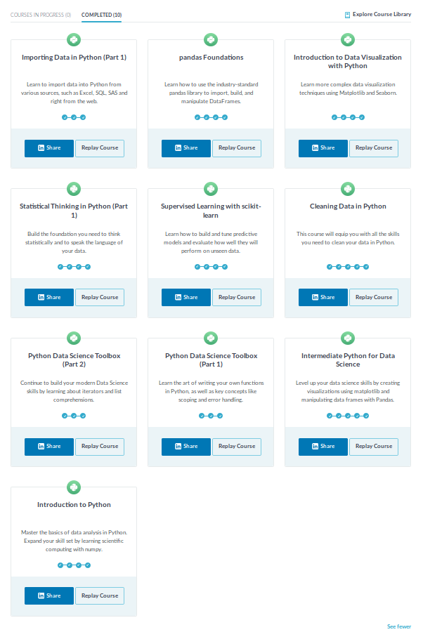

# Data Science Minor Personal Portfolio
This Github repository serves as personal portfolio for my Data science minor. The minor is taught at 
the Hague University of Applied Sciences and requires a personal portfolio that includes the contributions
to the project aswell as individual efforts. 

# Readers guide 
This page includes an introduction to the subjects that are mentioned in this repository. 
It is composed of three components. The courses, the Data science components and the project specific items. 

## Courses
The courses that I have done for this minor have 2 sources, one being Datacamp and the other being Coursera. 
These courses have both taught me a lot about datascience, and therefore helped me with the progress I have 
made in the field and the project.

### Datacamp
Starting with Datacamp. The approach to these courses was very practical. 
They usually taught e very specific part of data science and how you could implement this in code. 
Already having some experience in Python, some of there courses were a nice refresher 
while others taught me a lot.

In the Datacamp document I explain per course what every one of 
them has served me and how it helped me with the project.

[Link to Datacamp document](Courses/Datacamp.md)

Screenshot of completed datacamp courses

 

### Coursera 
Coursera's approach to learning Data science was far more theoretical, this was a perfect combination with 
Datacamp. Learning when to use instead of how to use, provided a lot of insight and sped up the 
learning process. The specific course is Machine Learning by Andrew NG, the founder of Coursera. 

[Link to Coursera document](Courses/Coursera.md) 

## Data Science Components
The components mentioned below are subcategories of datascience
of which the function will be explained by examples. These subcategories have either been a part of 
the project or have been experimented with individually. 

### Data collection 
introduction

[link to data collection document](Examples/Data%20Collection.md) 

### Data Preparation
introduction

[link to Data Preparation document](Examples/Data%20Preparation.md) 

### Data Visualisation
introduction

[link to Data Visualisation document](Examples/Data%20Visualisation.md) 

### Diagnostics of the Learning Process
introduction

[link to Diagnostics document](Examples/Diagnostics%20of%20the%20Learning%20Process.md) 

### Evaluation
introduction

[link to Evaluation document](Examples/Evaluation.md) 

### Predictive Models
introduction

[link to Predictive Models document](Examples/Predictive%20Models.md) 

## Project
### Presentations
Every week the progress that the project group made, had to be presented to our peers and teachers. 
These presentations were done in turns, usually by 2 presenters. I presented about every other
presentation. The making of the presentation and processing of feedback after the presentations has 
been a joint performance. 

School Week | Datum | Link
:---:|:---:|:---:
1 | 31-08-2018 | [link to presentation](/Resources/Presentations/2018.08.31 CBS Presentatie intro.pptx)
2 | 07-09-2018 | [link to presentation](/Resources/Presentations/2018.09.07 CBS Presentatie.pptx)
3 | 14-09-2018 | [link to presentation](/Resources/Presentations/2018.09.14 CBS Presentatie.pptx)
4 | 21-09-2018 | [link to presentation](/Resources/Presentations/2018.09.21 CBS Presentatie.pptx)
5 | 28-09-2018 | [link to presentation](/Resources/Presentations/2018.09.28 CBS Presentatie.pptx)
6 | 05-10-2018 | [link to presentation](/Resources/Presentations/2018.10.05 CBS Presentatie.pptx)
7 | 12-10-2018 | [link to presentation](/Resources/Presentations/2018.10.12 CBS Presentatie.pptx)
8 | 19-10-2018 | [link to presentation](/Resources/Presentations/2018.10.19 CBS Presentatie.pptx)
9 | 02-11-2018 | [link to presentation](/Resources/Presentations/2018.11.02 CBS Presentatie.pptx)
10 | 09-11-2018 | [link to presentation](/Resources/Presentations/2018.11.09 CBS Presentatie.pptx)
11 | 16-11-2018 | [link to presentation](/Resources/Presentations/2018.11.16 CBS Presentatie.pptx)
12 | 30-11-2018 | [link to presentation](/Resources/Presentations/2018.11.30 CBS Presentatie.pptx)
14 | 07-12-2018 | [link to presentation](/Resources/Presentations/2018.12.07 CBS Presentatie.pptx)
15 | 17-12-2018 | [link to presentation](/Resources/Presentations/2018.12.17 CBS Presentatie.pptx)
17| 21-12-2018 | [link to presentation](/Resources/Presentations/2018.12.21 CBS Presentatie.pptx)

### Extra
introduction
[link to extra document](Examples/Other.md)