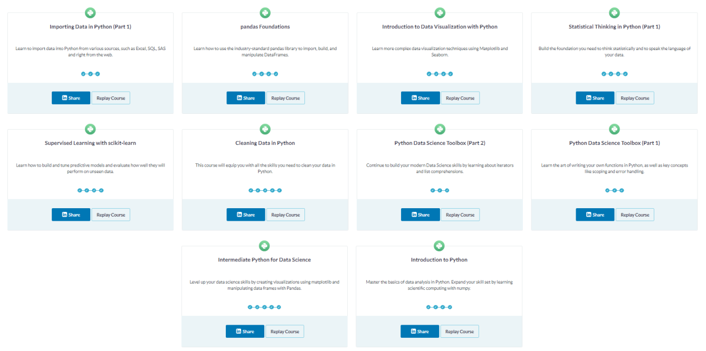
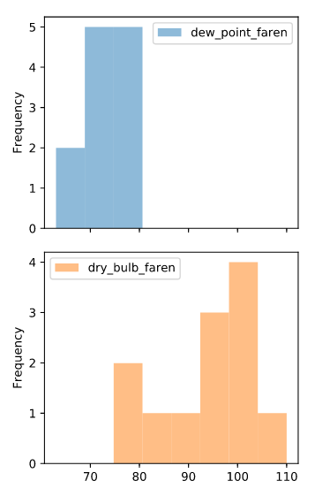
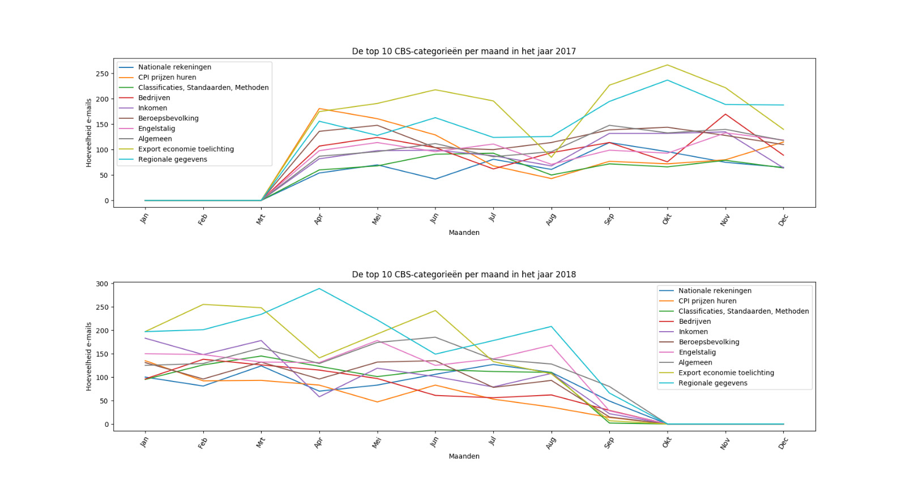
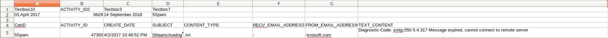
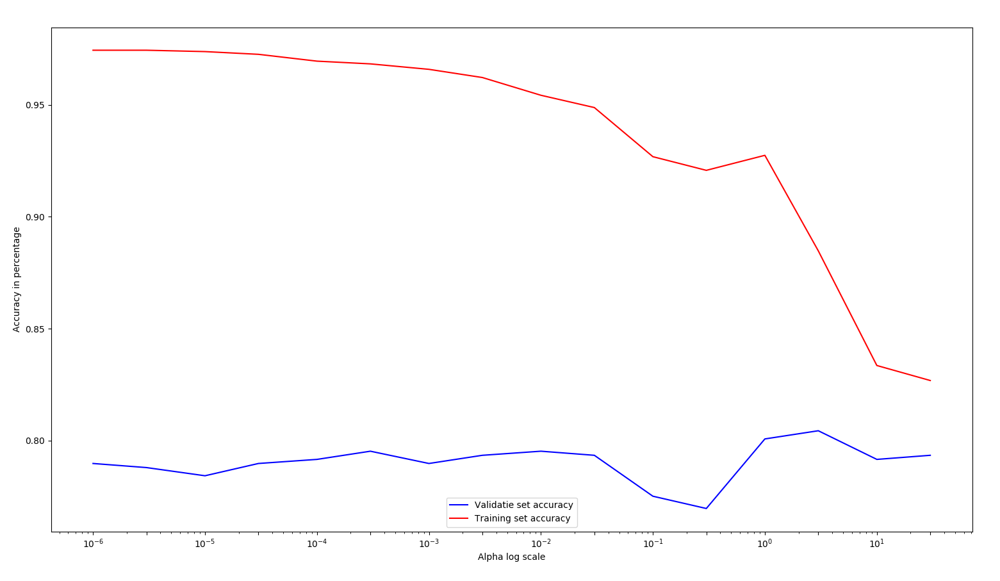

# Data Science Minor Personal Portfolio
This Github repository serves as personal portfolio for my data science minor. The minor is taught at 
the Hague University of Applied Sciences and requires a personal portfolio that includes the contributions
to the project as well as individual efforts. 

This page includes an introduction to the subjects that are mentioned in this repository. 
It is composed of three components. The courses, the data science components and the project specific items. 

The data used in the project, cannot be provided in this repository because it contains confidential data. Only 
the scores of the models and extra examples can be provided.

#Table of contents
- [Courses](#courses)
  * [Datacamp Courses](#datacamp-courses)
    + [Importing Data in Python (Part 1)](#importing-data-in-python--part-1-)
      - [Improvements by this course](#improvements-by-this-course)
    + [Introduction to Python](#introduction-to-python)
      - [Improvements by this course](#improvements-by-this-course-1)
    + [Pandas Foundations](#pandas-foundations)
      - [Improvements by this course](#improvements-by-this-course-2)
    + [Introduction to Data Visualization with Python](#introduction-to-data-visualization-with-python)
      - [Improvements by this course](#improvements-by-this-course-3)
    + [Statistical Thinking in Python (Part 1)](#statistical-thinking-in-python--part-1-)
      - [Improvements by this course](#improvements-by-this-course-4)
    + [Supervised Learning with scikit-learn](#supervised-learning-with-scikit-learn)
      - [Improvements by this course](#improvements-by-this-course-5)
    + [Cleaning Data in Python](#cleaning-data-in-python)
      - [Improvements by this course](#improvements-by-this-course-6)
    + [Python Data Science Toolbox (Part 1)](#python-data-science-toolbox--part-1-)
      - [Improvements by this course](#improvements-by-this-course-7)
    + [Python Data Science Toolbox (Part 2)](#python-data-science-toolbox--part-2-)
      - [Improvements by this course](#improvements-by-this-course-8)
    + [Intermediate Python for Data Science](#intermediate-python-for-data-science)
      - [Improvements by this course](#improvements-by-this-course-9)
    + [Coursera](#coursera)
      - [week 1](#week-1)
      - [week 2](#week-2)
      - [week 3](#week-3)
      - [week 6](#week-6)
  * [Data Science Components](#data-science-components)
    + [Data Collection](#data-collection)
      - [Examples](#examples)
        * [Retrieving from an API](#retrieving-from-an-api)
          + [Process](#process)
          + [Result](#result)
        * [Retrieving sentences from data set](#retrieving-sentences-from-data-set)
          + [Example email](#example-email)
          + [Process](#process-1)
          + [Result](#result-1)
        * [Collecting meta-data](#collecting-meta-data)
          + [Result](#result-2)
        * [Manual observations](#manual-observations)
          + [Process](#process-2)
          + [Result](#result-3)
    + [Data Preparation](#data-preparation)
      - [Data Cleaning](#data-cleaning)
      - [Retrieving the email](#retrieving-the-email)
        * [Example email](#example-email-1)
        * [Process](#process-3)
        * [Cleaning of the files itself](#cleaning-of-the-files-itself)
        * [Cleaning of the sentences](#cleaning-of-the-sentences)
      - [Feature Preparation](#feature-preparation)
    + [Visualization](#visualization)
      - [Confusion matrix](#confusion-matrix)
        * [In code](#in-code)
        * [Result](#result-4)
      - [Counts per month](#counts-per-month)
        * [In code](#in-code-1)
        * [Result](#result-5)
      - [Word web](#word-web)
        * [In code](#in-code-2)
        * [Result](#result-6)
    + [Manual Visualization](#manual-visualization)
      - [Scores](#scores)
        * [In code](#in-code-3)
        * [Result](#result-7)
    + [Diagnostics of the Learning Process](#diagnostics-of-the-learning-process)
      - [Datacamp](#datacamp)
      - [Coursera](#coursera-1)
      - [Project Related](#project-related)
      - [Other](#other)
      - [Communication](#communication)
      - [Document Sharing](#document-sharing)
      - [Conclusion](#conclusion)
    + [Evaluation](#evaluation)
      - [Bias](#bias)
        * [Problem](#problem)
        * [Solution](#solution)
      - [Variance](#variance)
        * [Problem](#problem-1)
          + [Example](#example)
        * [Solution](#solution-1)
      - [Evaluation metrics](#evaluation-metrics)
    + [Predictive Modelling](#predictive-modelling)
      - [Cost functions](#cost-functions)
    + [Regression](#regression)
      - [Linear](#linear)
        * [Example](#example-1)
      - [Polynomial](#polynomial)
      - [Regularization](#regularization)
    + [Classification](#classification)
      - [Practical Example](#practical-example)
      - [Code example](#code-example)
    + [Learning rate](#learning-rate)
  * [Project](#project)
    + [Presentations](#presentations)
    + [SCRUM](#scrum)
      - [Cleaning data](#cleaning-data)
        * [Description:](#description-)
        * [Process:](#process-)
        * [Result](#result-8)
      - [Formulating the research question](#formulating-the-research-question)
        * [Description:](#description--1)
        * [Process:](#process--1)
        * [Result:](#result-)
      - [Analyzing Received Data:](#analyzing-received-data-)
        * [Description:](#description--2)
        * [Process:](#process--2)
        * [Result:](#result--1)
    + [Extra](#extra)
      - [Classification Tooling to classify faster](#classification-tooling-to-classify-faster)
        * [The importing](#the-importing)
        * [The displaying](#the-displaying)

# Courses
The courses that I have done for this minor have 2 sources, one being Datacamp and the other being Coursera. 
These courses have both taught me a lot about data 
science, and therefore helped me with the progress I have 
made in the field and the project.

## Datacamp Courses
Datacamp takes a very practical approach to learning. Every course and chapter starts with a video explaining a 
concept, the assignments after that implement the explained topic with prepared data. This allowed me to 
experiment quite fast. The completed courses were mostly assigned however some of the assignments included just 
one or two chapters, I decided to complete all the partial courses.

Some of these courses contributed to the project. Others weren't relevant to the project but did 
expand our knowledge on data science as a whole. Below is a screenshot of the completed courses.



**Note: The courses discussed below, are not in order of completion.**

### Importing Data in Python (Part 1)
[link to course on Data Camp](https://www.datacamp.com/courses/importing-data-in-python-part-1)

This course is based on as the name suggests, importing data. During the course you get exercises for importing 
flat files, pickled files, spreadsheets and relational databases.

#### Improvements by this course
This course helped us discover an easy way to import the delivered data for the project as well as 
the parameters needed.

For example in our Importer, we used one of the most simple import functions from pandas. 
We also used a package 'pathlib' so we didn't have to pass the whole file adress.

```python
import pandas as pd
from pathlib import Path 

def read_csv_into_dataframe(classified_file):
    return pd.read_csv('{0}/result/{1}'.format(Path().absolute(), classified_file), error_bad_lines=False, skip_blank_lines=True).dropna()
```

### Introduction to Python
[link to course on Data Camp](https://www.datacamp.com/courses/intro-to-python-for-data-science)

This course teaches some Python basics as well as some data science specific Python code. 
The basic data types, introduction to functions and packages. Lastly some exercises about NumPy.

#### Improvements by this course
The first three chapters of this course were a refresher since I already had some Python experience. 
The last chapter however I was not familiar with NumPy and it's functions which turned out to be very useful later 
on. The specific knowledge from this part of numpy has been a foundation for the Pandas courses.


### Pandas Foundations
[link to course on Data Camp](https://www.datacamp.com/courses/pandas-foundations)

The Pandas foundations course taught the Pandas basics. Importing a dataframe, displaying a dataframe or part of it. 
Selecting a specific part of it and displaying information about the dataframe. It also contains some more 
advanced concepts as upsampling, downsampling and interpolation. Visualization is also included in this chapter. 

#### Improvements by this course
With the knowledge we acquired by this course we were able to generate dataframes to classify our sentences, 
learned how to make a dataframe from lists and export our dataframes to actually be able to classify them. 

For example, the exporting of a dataframe. As showed, could be done by a simple pandas dataframe function.
```python
# Save the cleaned up DataFrame to a CSV file without the index
dataframe.to_csv(file_name, index=False)
```

As for the visualizations, an example for this is in the 3rd chapter. It includes the making of a histogram. 

Input
```python
# Resample dew_point_faren and dry_bulb_faren by Month, aggregating the maximum values: monthly_max
monthly_max = df_clean[['dew_point_faren','dry_bulb_faren']].resample('M').max()

# Generate a histogram with bins=8, alpha=0.5, subplots=True
monthly_max.plot(kind='hist',bins=8,alpha=0.5,subplots=True)

# Show the plot
plt.show()
```

Output



### Introduction to Data Visualization with Python
[link to course on Data Camp](https://www.datacamp.com/courses/introduction-to-data-visualization-with-python)

As the title of the course portrays, this course teaches data visualization in Python. 
This includes customizing plots, e.g. adding titles, labels, legends and customizing colors for basic plots. 
For some more advanced plotting, how to visualize 2d arrays and a little Seaborn.

#### Improvements by this course
The easiest part of this course, customizing plots, has served the biggest purpose in the visualizations for 
the project. As I have made a few plots with this specific course next to it. An example for this is: 




### Statistical Thinking in Python (Part 1)
[link to course on Data Camp](https://www.datacamp.com/courses/statistical-thinking-in-python-part-1)
This is one of the more theoretical courses I have made. It includes graphical and quantitative exploratory 
data analysis, which comes down to finding properties of the data. Graphical searches these properties by 
visualizations and quantitative by summaries, averages, means etc. The second part of the course includes 
exercises to think probabilistically divided in discrete variables and continuous variables. 

#### Improvements by this course
This course has not specifically contributed to certain tasks. 
However I did find this more theoretical approach very interesting. 

### Supervised Learning with scikit-learn
[link to course on Data Camp](https://www.datacamp.com/courses/supervised-learning-with-scikit-learn)
This course contains very useful exercises for using scikit-learn. Specifically classification and regression problems,
fine-tuning models and pre-processing and pipelines. It shows some available functions, 
how to create models and which parameters to use.

#### Improvements by this course
This course has been a great foundation for our predictive modelling. Since scikit-learn includes a lot of easily 
accessible functions to create models, create features and tuning models, we decided to base most of our project
on the scikit package. This course has been the stepping stone to that choice. 

For example the use of count-vectors from our project: 

```python
count_vect = CountVectorizer(analyzer='word', token_pattern=r'\w{1,}', max_df=1.0, max_features=features)
        count_vect.fit(self.trainDF['cleaned_sentence'])
        xtrain_count = count_vect.transform(self.X_train)
```

Sklearn includes a [CountVectorizer](https://scikit-learn.org/stable/modules/generated/sklearn.feature_extraction.text.CountVectorizer.html) 
class which is implemented in just 3 lines of code. This allows for fast and
easy experimenting with the features. We didn't discover this from the course but it has lead us to it. 

### Cleaning Data in Python
[link to course on Data Camp](https://www.datacamp.com/courses/cleaning-data-in-python)
The cleaning data in python course goes into cleaning data. 
It's divided in exploring, tidying, combining and cleaning data. Each of these subjects cover a part of data cleaning, 
in order. Exploring the data to get to know if and what needs cleaning. Tidying to align everything properly. Combining 
data for fragmented data. Last, actually cleaning the data, manipulating the data on point or collection level.

#### Improvements by this course
This course delivered me practical steps to go about data cleaning. Since the first phase of the project revolved 
around data cleaning, this course served me and my project group well.

An example of implemented data cleaning used in the course is removing duplicates. This was an easy task in the course: 

```python
# Drop all the duplicates from countries
countries = countries.drop_duplicates()
```

Whereas on our data set in the project we found out that we had duplicates in the process of labeling. 
These duplicates were nested in the internal forward mails in the data. So in our project we had to 
find these forwards and remove them from the set. A detailed example is be provided in the data preparation file


### Python Data Science Toolbox (Part 1)
[link to course on Data Camp](https://www.datacamp.com/courses/python-data-science-toolbox-part-1)
This course touches on more advances uses of Python than the introduction. It expands on the knowledge of the 
introduction course. It includes writing functions, nested functions, explanations of arguments, scopes, lambda 
and last but not least error handling. 

#### Improvements by this course
As earlier mentioned, I already had some Python experience. The topics practised in this course, were known to me. 
However still provided a nice refreshing. The completion of the course did not directly result in tasks being created 
or completed in the project. The concepts in this course, did. Creating functions and 
error handling are present in the project.

For example, in the featuremetrics processor, the simpplest implementations of a function: 

```python
def get_precision_score(predictions, correct_classifications):
    return metrics.precision_score(correct_classifications, predictions)
```

The a part of the information from the course is included in the above example. 


### Python Data Science Toolbox (Part 2)
[link to course on Data Camp](https://www.datacamp.com/courses/python-data-science-toolbox-part-2)
In the second part of the Python data science toolbox, the exercises expand on the part 1 acquired knowledge. 
It teaches iterations, list comprehensions and generators.

#### Improvements by this course
The loops taught in this course were not new to me but have been included all over the project. Looping over the 
data set for pretty much every interaction with the data. 

For example, for getting the counts of every category in the data set. Looping through all the files:

```python
for csv in csv_files_list:
    df = self.read_file(csv)
    files_with_counts.append({'name': csv, 'count': df.shape[0]})
```

### Intermediate Python for Data Science
[link to course on Data Camp](https://www.datacamp.com/courses/intermediate-python-for-data-science)
The intermediate Python course, it teaches a lot of basic knowledge on how to use Python for data science. Using 
Matplotlib to visualize data. Using Dictionaries, Pandas dataframe to an extent not discussed in other courses. 
Logical statements to filter specific data points among other uses. It explains loops which have also been taught 
in the python data science toolbox part 2.

#### Improvements by this course
Most of the contents of this course is also basic programming knowledge. Therefore, the completion hasn't 
contributed to specific results. The concepts taught in the course have done so.


### Coursera 
[link to the course](https://www.coursera.org/learn/machine-learning)
The machine learning course on Coursera is taught by Andrew NG, the co-founder of the platform and a professor at
Stanford University. The course is taught with a more theoretical approach. The mathematics behind concepts are discussed and explained 
by examples. The course has taught me a lot and contributed to the project through understanding the functions we 
were using.

Since the subjects taught in this course overlap completely with the data science components, examples will be 
provided in those documents. The concepts taught in the course however will be listed underneath.

I have not completed all the 'weeks' in the course. The ones I did, are listed below.

#### week 1
* linear regression
* Gradient descent

#### week 2
* Multiple features 
* Polynomials 
* Gradient descent for multivariate
* Normal Equation


#### week 3
* Classification
* Hypothesis representation
* Descision Boundary
* Cost function
* Advanced optimization
* Multiclass Classification
* Overfitting
* Regularized Linear Regression
* Regularized Logistic Regression

#### week 6
* Evaluating a Learning Algorithm
* Model selection
* Bias vs Variance
* Diagnosis
* Regularization
* Learning curves


## Data Science Components
The components mentioned below are subcategories of data science
of which the function will be explained by examples. These subcategories have either been a part of 
the project or have been experimented with individually. 

### Data Collection
The collection of data is where data science starts. To be able to ask any questions about data, it needs 
to be present. The collection of data can be done numerous ways. It can already be existent and be retrieved from an 
external source. In some cases the data has to be manually retrieved for example interviews or manual measurements. 
In some cases it can be a derived data such as meta-data. 

Not all examples mentioned below originated from the project. The ones that are have this clarified in the description. 
#### Examples

##### Retrieving from an API
Retrieving the data from an api every day. 

###### Process
For example retrieving the recent public event on GitHub. This way of getting data is very common and could 
be used in a variety of ways. We did not use any such way of retrieving data in our project, but it is 
important to know the possibility.

```python
import requests
import json

#Easy API call to the github api using the Requests package. 
r = requests.get('https://api.github.com/events').json()
```

###### Result
```json
{
    "actor": {
        "avatar_url": "https://avatars.githubusercontent.com/u/178444?",
        "display_login": "tomberek",
        "gravatar_id": "",
        "id": 178444,
        "login": "tomberek",
        "url": "https://api.github.com/users/tomberek"
    },
    "created_at": "2019-01-10T13:05:36Z",
    "id": "8864608996",
    "payload": {
        "before": "ea27e1987d0c3ce9f05e7002436c8c4f2663cda5",
        "commits": [
            {
                "author": {
                    "email": "tom@dds.mil",
                    "name": "Tom Bereknyei"
                },
                "distinct": true,
                "message": "More usage printing for make-client-ovpn",
                "sha": "1e4d7eaeaa4a3bf26d7188e967390715b96de096",
                "url": "https://api.github.com/repos/tomberek/easy-ca/commits/1e4d7eaeaa4a3bf26d7188e967390715b96de096"
            }
        ],
        "distinct_size": 1,
        "head": "1e4d7eaeaa4a3bf26d7188e967390715b96de096",
        "push_id": 3197464862,
        "ref": "refs/heads/master",
        "size": 1
    },
    "public": true,
    "repo": {
        "id": 126281158,
        "name": "tomberek/easy-ca",
        "url": "https://api.github.com/repos/tomberek/easy-ca"
    },
    "type": "PushEvent"
}
```

The result in API calls is in JSON with most API calls. The code above is an example of a JSON response.

##### Retrieving sentences from data set 
The project data set was a big collection of emails. We needed sentences to be able to classify if something is a 
question or not. This 'collecting' of sentences can be classified as processing and collection as well, because it is 
retrieving something. Therefore this task is mentioned in this document. 

###### Example email
```text
Als ik inkomensdata over buurten wil opvragen via Statline, krijg ik constant een 404 foutmelding. Dit gaat via deze 
URL:
http://statline.cbs.nl/Statweb/selection/?VW=T&DM=SLNL&PA=81903NED&D1=0-10%2c26-32%2c88&D2=2018-2023&D3=1&HDR=T&STB=G1%2cG2
Aangezien jullie gepubliceerde wijken-en-buurten Excel files geen inkomensdata bevatten, zou ik deze graag via Statline 
willen opvragen. Vanaf welke computer ik het ook probeer, deze data set blijft een 404 foutmelding geven. 
Wat kan ik het beste doen?
```

###### Process
To actually get the sentences from an email body, we apply a nltk function, sent_tokenize to the email body. 
This is relatively easy. Just import and install the package then run the function with the email body and it 
returns a list of sentences.

```python
import nltk

nltk.sent_tokenize(email, 'dutch')
```
###### Result
```python
[
'Als ik inkomensdata over buurten wil opvragen via Statline, krijg ik constant een 404 foutmelding.', 
'Dit gaat via deze URL:  http://statline.cbs.nl/Statweb/selection/?VW=T&DM=SLNL&PA=81903NED&D1=0-10%2c26-32%2c88&D2=2018-2023&D3=1&HDR=T&STB=G1%2cG2', 
'Aangezien jullie gepubliceerde wijken-en-buurten Excel files geen inkomensdata bevatten, zou ik deze graag via Statline willen opvragen.',
'Vanaf welke computer ik het ook probeer, deze data set blijft een 404 foutmelding geven.', 
'Wat kan ik het beste doen?'
]
```

These sentences are easily splitted with the nltk package, specifically the sen_tokenize function. Our jow however 
was to split the most unuseful text before this tokenization by nltk. Usually it included extra information, 
emptied tags for the anonymization, formIds, whitespaces among other data.

##### Collecting meta-data
For example collecting all the data sizes from all the files in a folder. For this example, I used a package glob, 
to get all the files in a folder. And os.stat to collect metadata from a file. 

```python
import os
import glob

csv_files_list = glob.glob('/home/jan-laptop/Encfs/encryptedCBS/Emails_2/*.csv')

file_sizes = list()

for file in csv_files_list:
    file_sizes.append(os.stat(file).st_size)

print(file_sizes)
```

###### Result
The result in this case is a list of appended file sizes only. To make any useful conclusions, 
more information could be necessary. 

```python
[996844, 441042, 1774124, 482039, 2313891, 779334, 93313, 244707, 902, 1518910, 306037, 638204, 14348, 180045, 370400,
 167437, 151258, 26001, 5708492, 251742, 5922, 259823, 840430, 792685, 750991, 623709, 490938, 587255, 1188337, 228382, 
 333982, 88232, 1465931, 617849, 125772, 141245, 274742, 156698, 291811, 2762716, 1474973, 86153, 374348, 1548650, 
 1340277, 351880, 2303203, 167325, 3414839, 954847, 115226, 1321579, 50231, 1439777, 922, 2875144, 406573, 86501, 
 576244, 1216955, 573381, 133331, 181652, 158567, 75471, 137501, 304317, 433053, 274204, 3764516, 8397, 190193, 
 397197, 81363, 414402, 1283599, 1575950, 358952, 559547, 912438, 4471333, 1042222, 1068397, 178085, 1477548, 504882, 
 699892, 118355, 524013, 309084, 19096, 827927, 280116, 225003, 4899970, 476795, 1790263, 841950, 16908289, 25681, 
 890, 26671, 7543061, 175029, 173998, 244422, 155047, 287333, 720014, 888654, 52759, 154771, 347828, 1133198, 9720769, 
 466198, 2121776, 470148, 854836, 188721, 4935856, 1717242, 566924, 1289253, 4071, 126339, 8519, 5593717, 503752, 
 2041506, 274046, 472139, 134458, 37261, 666361, 169796, 264141, 1054811, 39823, 504782, 237663, 139183]
```

##### Manual observations
Checking the weather everyday on your weather station and writing it down, is a way of collecting data. 
This process would take a lot of time and since this data is publicly available, would be redundant but for 
the explanation:

###### Process
* Waking up
* Checking the thermometer
* Checking the wind speed
* Checking the wind direction
* Checking the humidity
* Write these statistics down

###### Result
Doing this process daily for x amount of time could result in a data set as such: 

Date | Temperature | Wind Speed | Wind Direction | Humidity |
-----| ------------| -----------| ---------------| ---------|
01-12-2018 | 28 | 15 | NW | 5 |
02-12-2018 | 26 | 13 | NW | 12 |
03-12-2018 | 25 | 18 | SW | 8 |
04-12-2018 | 24 | 19 | SW | 4 |
05-12-2018 | 23 | 3 | NW | 7 |

### Data Preparation
For this document, the preparation of data includes the cleaning of data and the preparing of features. 
Data preparation is the process of turning your data into the most optimal information for your predictive model.
For out project and data set this meant filtering the useless data, cleaning the email itself as much as 
possible and normalizing the data. Implementing the preparing of features was a rather easy task because of 
the package we used, sklearn. 

#### Data Cleaning 
Starting with data cleaning. This process became an obvious task after analyzing the first data set. 
It included double emails, internal emails, emptied tags etc. We started this process by actually getting the 
email body from the text content. 

#### Retrieving the email
##### Example email
For this portfolio email I display an English example, however the goal in the project was to retrieve the Dutch 
topics. The English emails have been filtered. 

```text
formID: 1030
         Name: Pat
Email_address: -
EmailContactpersoon: -
   Telefoonnr: -
   submitTime: 4/06/2017 10:25:45 PM
Subject: Labour and social security 
Question:
Hi - is it possible to obtain the unemployment rate for the last 10 years in the entire country and the city of Amsterdam?  Many thanks, Pat
```

##### Process
We attempted to find rules in the syntax that the data was in. After some analysis we found out the best general 
rule we could set up was: the actual email content starts with 'Question: \n' in the English examples and 'Vraag: \n'
in the Dutch examples. This is also how we managed to filter the English emails. This rule did not apply at all times, 
but did so sufficiently. 

The code associated with this process is displayed below:
```python
split = str(raw_text_context).split('Vraag:', 1)

if len(split) == 1:
    split = raw_text_context.split('Question:', 1)
    if len(split) > 1:
        return

if len(split) > 1:
    split.pop(0)

return split[0]
```
We applied this function to every email and appended this to a list or dataframe. 

##### Cleaning of the files itself 
Before signing the NDA we asked to receive the following data set in a different format, preferrably a CSV. We did 
receive the rest of the data in this format but it contained some extra data from the export in every file. To 
split this we simply read every CSV as a text file and splitted on 'CATID', then exported the value of index 1 in the 
list of the result as a new CSV. 

Before the cleaning


After the cleaning


##### Cleaning of the sentences
example of the cleaning of a sentence
For cleaning sentences we applied several methods. These include the normalisation of locations, numbers and urls. 
The removal if diacritics, spaces, punctuation and stopwords. For this example I will enlighten the way we 
normalized locations. 

To be able to normalize locations we had to be able to recognise these. We collected a table of all the villages 
and towns and made a function that checked for every word in a sentence if it was equal to any of the locations in 
the list. To check this we used a regex.

```python
import re
def normalize_location_data(self):
    regex = re.compile(r'\b%s\b' % r'\b|\b'.join(map(re.escape, self.locations)))
    self.sentence = regex.sub('LOCATIE', self.sentence)
```
Because we had to check 2 lists with each other, we optimized the speed of this process by creating a regex that 
included all of the locations. In this example self.locations was the list of locations and self.sentence is the 
sentence.

#### Feature Preparation
Feature preparation in our project was quite a simple process as mentioned earlier. We used Sklearn for this process 
which included functions for the types of features we used. We found out how to use these feature preparators by 
referencing the Sklearn documentation.

```python
from sklearn.feature_extraction.text import CountVectorizer

def count_vectors(all_text, X, amount_features=None):
    count_vect = CountVectorizer(
        analyzer='word', token_pattern=r'\w{1,}', max_df=1.0, max_features=amount_features)

    count_vect.fit(all_text)
    X_count = count_vect.transform(X)

    return X_count
```

For all of these instances we created a class, the FeaturePreparator with the necessary parameters. The class contains 
functions for count_vectors, TFIDF on word level, TFIDF on n-gram level, TFIDF on character level.


### Visualization 
Data visualization is the way to communicate results most efficiently. the goal is to provide insight at the first 
look. I have performed visualization with plotting as well as manually.  

In the project we diagnosed most actions and progress based on visualizations. Beneath I will elaborate a few of the 
visualizations that are project related.

#### Confusion matrix
A confusion matrix is a matrix that displays the true positives, false positives, true negatives and false negatives 
in a diagram. We have created these in a normalized way as well as a non-normalized way.

##### In code 
To get the matrix data, Sklearn has a function called confusion_matrix. The parameters passed to this function are the 
predictions and valid answers.

```python
from sklearn.metrics import confusion_matrix
import itertools
import numpy as np
import matplotlib.pyplot as plt
    
# Retrieving the matrix data, passing the valid classifications and prediction classifications.
cm = confusion_matrix(valid_classifications, prediction_classifications)

# The 4 classes that the scores(1,2,3,4) represent.
classes = ['Beschikbaarheidsvraag', 'Verduidelijkingsvraag', 'Niet relevant', 'Relevante query vraag']

plt.imshow(cm, interpolation='nearest', cmap=plt.cm.Blues)
plt.title('Confusion matrix')
plt.colorbar()
tick_marks = np.arange(len(classes))
plt.xticks(tick_marks, classes, rotation=45)
plt.yticks(tick_marks, classes)

threshold = cm.max() / 2.

for i, j in itertools.product(range(cm.shape[0]), range(cm.shape[1])):
    plt.text(j, i, format(cm[i, j], 'd'), horizontalalignment="center", color="white" if cm[i, j] > threshold else "black")

plt.ylabel('True label')
plt.xlabel('Predicted label')
plt.tight_layout()
```

##### Result
The result of this code is the image below. It allowed us to see the scores for every category in a clear way. 


#### Counts per month
The visualization example below was one of the firsts global insights we created in the extended data set. 
After receiving this we wanted to visualize some statistics on the complete set. 
By extracting the amount of emails per month per category, we were able to create the graph below. 

##### In code
The code associated with this graph will be pasted and explained below. 

```python
import matplotlib as plt

def visualize_categories(self, file_name, month_counts, legends):
    # Since the file names contain some extra non-descriptive characters, they are removed for the plot.
    correct_file_name = file_name.split('/').pop().split('.')[0][1:]
    plt.title(correct_file_name)
    # Add the ticks to the plot
    plt.xticks(list(month_counts.keys()), ('Jan', 'Feb', 'Mrt', 'Apr', 'Mei', 'Jun', 'Jul', 'Aug', 'Sep', 'Okt', 'Nov', 'Dec'), rotation=60)
    plt.xlabel('Maanden')
    plt.ylabel('Hoeveelheid e-mails')
    #plt.plot returns more values, by using line, it only saves the first returned argument and disposes the rest. 
    line,  = plt.plot(month_counts.keys(), month_counts.values(), label=correct_file_name)
    legends.append(line)

def get_and_plot_all_categories(self):
    plt.clf()
    plt.cla()
    # In the called function below the top 10 categories are concatinated to 1 dataframe, since every row includes a 
    # date and the CATID, we were able to count the emails per month per category. The function creates a dictionary 
    # with counts per month, per category. 
    files_with_counts_per_month = self.get_csv_counts_all()
    legends = list()

    # For every category in the dictionary, the visualize method is called. This visualize method appends a new line
    # to the plot. 
    for k, v in files_with_counts_per_month.items():
        self.visualize_categories(k, v, legends)

    plt.title('De top 10 CBS-categorieën per maand')
    plt.legend(handles=legends)
    plt.show()
```
##### Result
The result of the above explained code is this graph.


#### Word web
A word web is a way of visualizing the topics we retrieved from NMF and/or LDA. These wordwebs are as the name 
suggests, webs of words. To actually make these wordwebs, I found a package wordclouder. This actually rendered a 
wordweb based on a corpus. Since the topics retrieved from LDA were words, I had to make a function that got the 
counts of the topic words and created a corpus by appending the words as many times as they occur in the data set.

##### In code 
```python
from wordcloud import WordCloud
import matplotlib.pyplot as plt

def create_wordcloud(self, max_words, wordcloud_corpus):
    # The parameters for the wordcloud generation are pretty straight forward.
    # Collocations, is a setting to include word pairs. This setting wasn't used. 
    
    wordcloud = WordCloud(
                            background_color='white', 
                            width=1600, 
                            height=1000, 
                            collocations=False, 
                            max_words=max_words,
                            stopwords=self.stopwords).generate(wordcloud_corpus)
    # Since the wordcloud is generated as an image, I used imshow to display it. 
    plt.imshow(wordcloud, interpolation='bilinear')
    plt.axis("off")
    plt.show()
    plt.clf()
    plt.cla()
```
##### Result


### Manual Visualization
At a certain point, I made exports of scores with a lot of different hyperparameters and or models. 
I then used these exports to create graphs in google spreadsheet, instead of with Python.
#### Scores
This example was the visualization of scores for different ratios of skewed data. To generate this graph, 
I used the exports instead of the data in python.
##### In code 
Since the code was not relevant for the visualization, it isn't included in this piece. But to explain briefly, 
the code created models for a range of values and these models were each tested and exported the scores. 

The result of the code as data is displayed below. 


##### Result
The resulting graph with the data from the export displayed above.


### Diagnostics of the Learning Process
During this minor I learned more on machine learning than I would have thought. Since the concept of AI and ML 
seemed very abstract I expected the course to include a lot of theory. The fact that a lot of it came down to 
practical implementations and experiments, causes me to be even more interested in the subject. 

Unfortunately I cannot point to any real evidence of progression of learning other than the results provided in the 
form of examples. I had next to no knowledge of most of these subjects and do now. 

#### Datacamp
Datacamp has started this practical process. The approachable way of teaching, appeals to me. The assigned courses 
came to be very useful as well. This process did not run into any specific problems, learning related. The courses 
followed up well and expanded on each others knowledge.

#### Coursera
Coursera provided a nice background to Datacamps practical work. The theory taught had an understanding of the 
concepts as result. As opposed to datacamp where it was not understanding how it worked but how  certain concepts 
can be implemented.

#### Project Related 
The tasks and experiments in the project were a key component to a lot of the understanding. Because we had to 
find out most of the solutions to problems we had, we read a lot and tried a lot of different things.

#### Other
Jeroens lessons specifically taught me different views on the same subjects as coursera. These different views 
provided a broader understanding of the taught concepts, this did help in the learning process. 

#### Communication
The communication between project group peers was good. There were no limitations regarding communication. Everybody
felt and was approachable and willing to share and or help progress the project.

#### Document Sharing
The document sharing we set up was through sharepoint, with Word online as platform to edit documents. This was not a 
good experience and limited us a number of times where files got corrupted, working on the same document together was 
not possible as well as the layout not displaying properly across our computers. I would not use this service again. 

#### Conclusion
The different sources of information and different types of tasks formed a well thought out process. All pieces 
were placed right, in my experience. 


### Evaluation
The part of the field to determine which how a model performs and how to take action.
Each of these explained by example and how to take action and result after action 

#### Bias
##### Problem
The problem in bias is that the model is too simple to actually fit the data. An example for this would be the tests 
I have done on skewed data. For these tests I needed balanced data for all classifications. The problem with this is 
that we did not have many examples for 2 of the 4 classes in our data. It was good enough to search for the skewed 
data tests, but as a model it would not be sufficient. We only had 472 Training examples for this test. 

With such limited data, the model did perform not as well as the full on version with about 5000 training examples.
The scores, even with a balanced dataset 118 examples across the classifications, were significantly lower. 
Below the data for different models on different ratios. The scores in the table are the F1 Scores.

ratio| 	Logistic Regression	| Multinomial NB | Complement NB
---|---|---|---|
1         |0.66	|0.71 |0.71
2	      |0.60	|0.64 |0.59
3	      |0.65	|0.57 |0.54
4	      |0.74	|0.59 |0.49
5	      |0.68	|0.56 |0.53
6	      |0.76	|0.57 |0.55
Average   |0.68	|0.61 |0.57


##### Solution
Solutions to High bias are: 
* Add more features
* Add polynomials
* Reduce Regularization

This can be displayed by the F1-scores on the model with all training examples.
Below a table for the best results for the Logistic Regression, Multinomial and Complement NB. 

Logistic Regression | Multinomial NB | Complement NB
:---:|:---:|:---:
0.81|0.75|0.70

These results are with each, more than 10% increased on the cross validation score. So we can conclude that adding 
more data does indeed result in better scores if the model is biased.

#### Variance
##### Problem
The problem with variance is a model that is too fit on the data. The model does not perform as well generally,
or in the scope of experimenting, on the test data. 

###### Example
In the first few weeks we encountered this problem. We made a mistake with scoring the model and thought that the 
score we retrieved was on our test set but it actually was on our training set. This caused us to tune our model wrong. 
Which we later found out and retuned the models we did have. 

Unfortunately I was not able to retrieve the code associated with this problem we had. 

##### Solution
The solutions to variance are: 
* Use more data
* Apply regularization
* Use less features

When these solutions are applied. The model will perform better on the test if the problem was high variance set. 

#### Evaluation metrics 
Scoring models can be done in a variety of ways. Each of these scores serve to display a different type of 
evaluation for a model.The scores we used mainly to score our model are explained below. 


### Predictive Modelling
Predictive modelling is the actual code that is the implementation of machine learning or AI. These are ways to 
find correlations between found parameters or features in your data set. 

#### Cost functions
A big part in predictive modelling is the understanding of the cost function. There are several types of cost 
functions for types of scoring. The cost functions generally is a function that calculates the error for a 
specific model. It does so by getting the cumulative error on the training examples of a model. The function that 
fits the model iterates over the data to find the function(model) with the smallest output of the cost function.

For our project, we didn't have to write these ourselves, they were included in the functions from scikit-learn. 

### Regression
Regression is a concept where you try to regress data to a function. You try to fit the data to a line with the 
smallest error.

#### Linear
Linear regression is the  form of regression where you regress data to a linear line. The function for such 
a line has a format of y= ax + b. 

##### Example
Var1(x) | Output (y)
---|---
0 | 1
1 | 2
2 | 5
3 | 7
4 | 9

Fitting a line to this data can be achieved in several ways. But to serve the purpose of this easy example, I will 
just state state that the function that fits this data perfectly is y = 2x+1. 

This function would look like this in a plot


#### Polynomial
Now, a polynomial is a function that is more complex than a linear function. It includes exponentials and higher 
polynomial features. This means it can fit more complex data as well. Finding this function however is more complicated. 
A simple calculation often won't ddo the trick. So there are functions to find the optimal values for fitting data. 

One of these methods is gradient descent. You try to approximate the 0 point for the derivative of the cost function. 

#### Regularization
Regularization is a factor in machine learning that penalizes extreme values. This parameter can be passed to 
create a more generalized model. It adds a weight to the value of features. In case these features get extreme values, 
the cost they add to the cost function will be big aswell. Since the goal is to minimize that, the optimal function 
found, will contain less extreme values.

### Classification
Classification broadly explained is the creating of a machine learning model that can put out a discrete value. An 
example of this is a binary classifier that either outputs 1 or zero.

#### Practical Example
Referring to the manual data collection example for weather data. The difference is the value you are 
trying to predict. When trying to predict the temperature, this could be any continuous value. This would not be 
the case for wind direction. There are 8 different values for this. If you would train a model to classify the 
outcome of wind direction, it would have to be one of the possible values, hence classification. 

Date | Temperature | Wind Speed | Wind Direction | Humidity |
-----| ------------| -----------| ---------------| ---------|
01-12-2018 | 28 | 15 | NW | 5 |
02-12-2018 | 26 | 13 | NW | 12 |
03-12-2018 | 25 | 18 | SW | 8 |
04-12-2018 | 24 | 19 | SW | 4 |
05-12-2018 | 23 | 3 | NW | 7 |

#### Code example
The next code example will be a multinomial Naive Bayes model, based on count vectors. It is a simplified version 
of the code implemented in our project. In the project, the actual function is made to check several models 
based on count vectors, and export their scores to a CSV file. 

```python
from sklearn import multiclass
from sklearn.feature_extraction.text import CountVectorizer
from sklearn import linear_model, naive_bayes
from sklearn.metrics import precision_recall_fscore_support as score
 
def count_vectors(self, features):
    count_vect = CountVectorizer(analyzer='word', token_pattern=r'\w{1,}', max_df=1.0, max_features=features)
    count_vect.fit(self.trainDF['cleaned_sentence'])
    
    xtrain_count = count_vect.transform(self.X_train)
    xcross_count = count_vect.transform(self.X_cross)

    model = naive_bayes.MultinomialNB(alpha=0.767, class_prior=None, fit_prior=True)
    mc_model = multiclass.OneVsRestClassifier(model)
    classifier = mc_model.fit(xtrain_count, self.y_train)

    # Cross Validation predictions
    self.check_model(classifier, xcross_count, self.y_cross)
       
def check_model(self, classifier, X, y):
    predictions = self.funcs.return_prediction_data(classifier,
                                                    X)
    classifications = y.reset_index(drop=True)
    precision, recall, f_score, true_sum = score(classifications,
                                                 predictions,
                                                 average='weighted')
```
The function 'count_vectors' serves to 
* Create the Count vectorizer
* Transform the data to vectors
* Initiate a Naive Bayes classifier
* Apply it to the OneVSRestClassifier from Scikit-learn 
* Fit the data to this model

It then passes the trained model to the check model function which puts out the scores for in this case 
cross validation only.


### Learning rate
When training models, it is key to find the right alpha, or the so called learning rate. If the alpha is too big, 
cost function may never find a minimum because it overshoots. If the alpha is too small, it may never find it either 
because it will not reach the minimum with a given amount of iterations. We illustrated the effect the alpha has on 
the results by training the model with different values of alpha and plotting the scores on the training and test set. 



As you can see, the model performs worse on very small alpha values, as well as performing less than optimal on too 
large values of alpha. Higher than 3, it overshoots the optimal values. 


## Project
### Presentations
Every week the progress that the project group made, had to be presented to our peers and teachers. 
These presentations were done in turns, usually by 2 presenters. I presented about every other
presentation. The making of the presentation and processing of feedback after the presentations has 
been a joint performance. 

School Week | Datum | Link
:---:       |:---:  |:---:
1   | 31-08-2018 | [link to presentation](https://github.com/Janlorie/DataScienceMinor/tree/master/Resources/Presentations/2018.08.31%C%Presentatie%intro.pptx)
2   | 07-09-2018 | [link to presentation](https://github.com/Janlorie/DataScienceMinor/tree/master/Resources/Presentations/2018.09.07%C%Presentatie.pptx)
3   | 14-09-2018 | [link to presentation](https://github.com/Janlorie/DataScienceMinor/tree/master/Resources/Presentations/2018.09.14%C%Presentatie.pptx)
4   | 21-09-2018 | [link to presentation](https://github.com/Janlorie/DataScienceMinor/tree/master/Resources/Presentations/2018.09.21%C%Presentatie.pptx)
5   | 28-09-2018 | [link to presentation](https://github.com/Janlorie/DataScienceMinor/tree/master/Resources/Presentations/2018.09.28%C%Presentatie.pptx)
6   | 05-10-2018 | [link to presentation](https://github.com/Janlorie/DataScienceMinor/tree/master/Resources/Presentations/2018.10.05%C%Presentatie.pptx)
7   | 12-10-2018 | [link to presentation](https://github.com/Janlorie/DataScienceMinor/tree/master/Resources/Presentations/2018.10.12%C%Presentatie.pptx)
8   | 19-10-2018 | [link to presentation](https://github.com/Janlorie/DataScienceMinor/tree/master/Resources/Presentations/2018.10.19%C%Presentatie.pptx)
9   | 02-11-2018 | [link to presentation](https://github.com/Janlorie/DataScienceMinor/tree/master/Resources/Presentations/2018.11.02%C%Presentatie.pptx)
10  | 09-11-2018 | [link to presentation](https://github.com/Janlorie/DataScienceMinor/tree/master/Resources/Presentations/2018.11.09%C%Presentatie.pptx)
11  | 16-11-2018 | [link to presentation](https://github.com/Janlorie/DataScienceMinor/tree/master/Resources/Presentations/2018.11.16%C%Presentatie.pptx)
12  | 30-11-2018 | [link to presentation](https://github.com/Janlorie/DataScienceMinor/tree/master/Resources/Presentations/2018.11.30%C%Presentatie.pptx)
14  | 07-12-2018 | [link to presentation](https://github.com/Janlorie/DataScienceMinor/tree/master/Resources/Presentations/2018.12.07%C%Presentatie.pptx)
15  | 17-12-2018 | [link to presentation](https://github.com/Janlorie/DataScienceMinor/tree/master/Resources/Presentations/2018.12.17%C%Presentatie.pptx)
17  | 21-12-2018 | [link to presentation](https://github.com/Janlorie/DataScienceMinor/tree/master/Resources/Presentations/2018.12.21%C%Presentatie.pptx)

### SCRUM 
During the starting week of our project, we were advised to use SCRUM as a way to track our progress. 
This document contains a few examples of tasks I have participated in or have completed myself. 
These tasks will be explained by how they have been useful for the project.

#### Cleaning data
##### Description:
This ticket was made to clean the data we received from our project owner. We had received the data as a text 
file that included loads of not useful data. After the analysis of data, we were able to clean the data partially. 
##### Process: 
We started from the analysis, which showed us that the emails included an empty from tag, an empty to tag, 
a formId and some other attributes and texts that weren’t part of the email. In the process we removed this data by splitting on them and joining the rest of the mails.

##### Result
This task resulted in a function that was able 


#### Formulating the research question
##### Description:
For this task we had a meeting with our product owner. We discussed the general goal of the project and tried to phrase a research question that corresponded to their wishes.

##### Process: 
To the best of our abilities at the time, we set up a few options to discuss during the meeting with our product owner. During the conversation however, we found out the assignment was different than what we were told. The options we had set up, did contribute to the conversation.  

##### Result: 
The result of this task was the research question we came up with during this week. It has been revised in the meantime. The research question was: “Which data mining and Natural Language Processing methods can be used to filter the most frequently asked questions from unstructured e-mails sent to the Central Bureau of Statistics between 2017 and 2018?”


#### Analyzing Received Data:
##### Description: 
This ticket was made to analyze the data we received from our project owner. 
The data was given in a  txt file with no explanation of the structure. So we had to do our analyses the file by ourself and figure out the way the file was dumped from their database. 

##### Process:
We started by opening the file in a text editor to get an idea of the structure. 
After some time we noticed it was a dump of emails containing the original questions asked to our project owner and replies from the people who answer their questions. For us the goal of this task was to find a specific separator to filter out the questions asked. 

##### Result:
In the file we found that the word: Vraag:  (question in dutch) was a separator that we could use to filter out the asked question. After this separator the questions was noted and it would end with the word: Category. This could be used as a second separator to filter out the original question. With this result we could start our next task to build a data cleaner to filter out all the asked questions from the datafile. 

We did not use the SCRUM method during the whole project. During the 6th sprint we discussed how useful it has been
and would still be to continue using the SCRUM tasks and came to the conclusion it would be better not to.

### Extra
#### Classification Tooling to classify faster


After we decided to change from a binary classifier to a multiclass classifier. 
I decided to make a tool to make this process faster and easier to check. 

The tool imports all thee pre-made sentences. 
Displays 9 sentences on the screen where the middle one, is the current sentence. 
The tool waits for a classification (1, 2 , 3 or 4) and appends this sentence with 
classification to the classified sentences file. After that it gets the next sentence and so on. 
On restarting the tool, it begins where you left off.

Below a few code examples: 

##### The importing
The importing is done by the Importer from our project. 

```python
def import_classified_sentences(classified_file):
    reader = csv.reader(
        open('{0}/result/{1}'.format(Path().absolute(), classified_file), mode='r'))
    sentences = list()
    for index, row in enumerate(reader):
        if index == 0:
            continue
        score, sentence = row
        sentences.append({'score': score, 'sentence': sentence})
    return sentences
```

##### The displaying
The displaying is done with the Tkinter package. This provides a rather simple way of 
displaying text as well as others but they weren't necessary for this tool. 

First, the sentences are imported. and the starting index is retrieved. The startup function is called. It sets up a root class, for this root class I 
then bind the keyPress event to a function that handles the keyPress. Then set a 
few attributes and center the window. Append the first sentences to the window and 
start the main Loop. After which the tool waits for a classification input. 

```python
    def start_classification(self):
        root.bind('<KeyPress>', self.key_press)
        root.title('N-gram Classifier')
        root.geometry('1800x350')
        root.configure(background="#F0F0F0")
        print(self.starting_index, 'Starting')

        for i in range(self.starting_index - 4, self.starting_index):
            label = Label(root, text=all_sentences[i]['sentence'])
            label.configure(font=('Courier', 15))
            label.pack()
            self.labels.append(label)

        self.to_label_ngram = Label(root, text=all_sentences[self.starting_index]['sentence'])
        self.to_label_ngram.configure(font=('Courier', 25), bg="White", wraplength="1800")
        self.to_label_ngram.pack()

        for i in range(self.starting_index, self.starting_index + 4):
            label = Label(root, text=all_sentences[i]['sentence'])
            label.configure(font=('Courier', 15))
            label.pack()
            self.labels.append(label)

        self.center_window(root)
        root.mainloop()
```

On pressing a key, it appends the classification and sentence to the classified file. Then it ups the index, 
removes the sentences from the screen and appends the new ones. 
